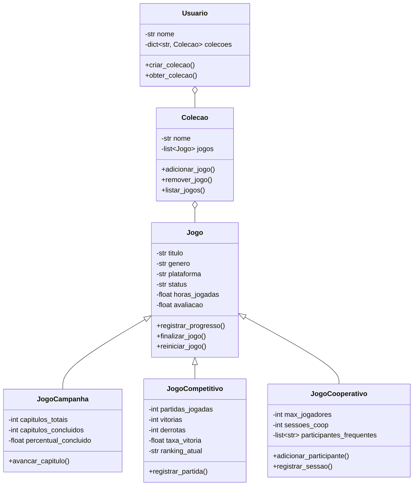

## 🏗️ Estrutura Planejada de Classes (Diagrama UML)

```mermaid
classDiagram
    class Jogo {
        -str titulo
        -str genero
        -str plataforma
        -str status
        -float horas_jogadas
        -float avaliacao
        +registrar_progresso()
        +finalizar_jogo()
        +reiniciar_jogo()
    }

    class JogoCampanha {
        -int capitulos_totais
        -int capitulos_concluidos
        -float percentual_concluido
        +avancar_capitulo()
    }

    class JogoCompetitivo {
        -int partidas_jogadas
        -int vitorias
        -int derrotas
        -float taxa_vitoria
        -str ranking_atual
        +registrar_partida()
    }

    class JogoCooperativo {
        -int max_jogadores
        -int sessoes_coop
        -list~str~ participantes_frequentes
        +adicionar_participante()
        +registrar_sessao()
    }

    class Colecao {
        -str nome
        -list~Jogo~ jogos
        +adicionar_jogo()
        +remover_jogo()
        +listar_jogos()
    }

    class Usuario {
        -str nome
        -dict~str, Colecao~ colecoes
        +criar_colecao()
        +obter_colecao()
    }

    Jogo <|-- JogoCampanha
    Jogo <|-- JogoCompetitivo
    Jogo <|-- JogoCooperativo
    Colecao o-- Jogo
    Usuario o-- Colecao
```
